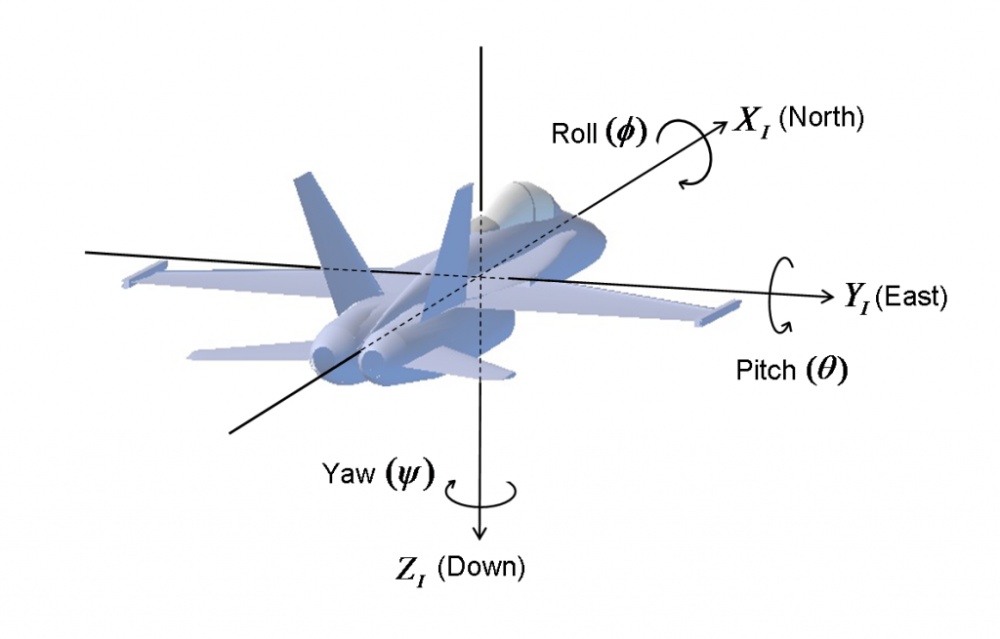
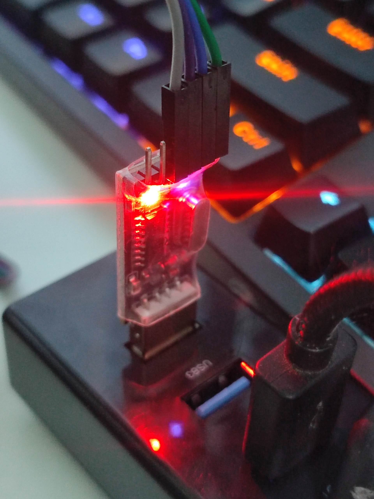

# FLIGHT SIMULATOR
This is the final project of the Embedded Systems course. The project simulates an airplane cockpit on the Google Earth application using the tilt angles of the MPU6050 sensor.
## Demo
Link Youtube: https://youtu.be/RT9tjAn6bP0
## Definition of Pitch and Roll angles

## Calculate Pitch and Roll angles
- When the MPU6050 sensor is not moved:
  Pitch and Roll angles are calculated below:
  
  
  
  
- When the MPU6050 sensor is moved:
  Pitch = Integral from 0 to t of Gyroscope Y, Roll = Integral from 0 to t of Gyroscope X. Because when the sensor moves, the value of Gyroscope X, Y is a discrete value, so to calculate the fraction, calculate
the area under the graph by summing the areas of the trapezoid.
  

## Electrical Cabinet

### Flight control
- Flight control

- The MPU6050 sensor mounted on the flight control is made of PVC pipe

### USB to TLL
USB To TTL CH340G Converter Module Adapter. Use it to transfer data through UART

